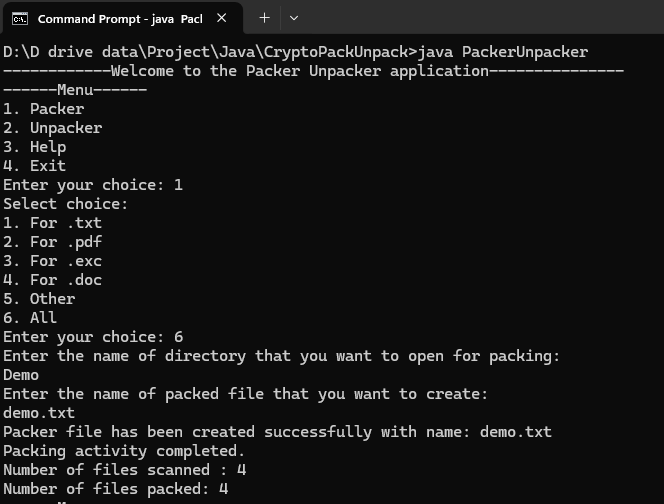
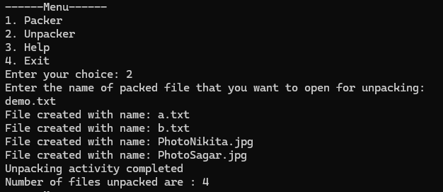

# 📦 Packer-Unpacker Console Application in Java

A **menu-driven Java application** to pack multiple files from a directory into a single file and unpack them back to original form. This project demonstrates the use of **Java File I/O**, **byte stream manipulation**, **custom file headers**, and **basic console interaction**.

---

## 📌 Features

- 📁 **Packing**: Combines multiple files from a folder into one packed file with custom headers.
- 📂 **Unpacking**: Extracts individual files from the packed file using metadata stored in the header.
- 🧭 **Menu-Driven UI**: Console-based user interaction using `Scanner` and `switch-case`.
- 📜 **Custom Header Format**: Each file is preceded by a 100-byte header containing file name and size.
- 🧹 **Clean Design**: Structured with modular methods for maintainability and clarity.
       
---

## 🛠 Technologies Used

- Java 8+
- Core Java (OOP)
- File I/O (`File`, `FileInputStream`, `FileOutputStream`)
- Exception Handling
- Console-based UI with `Scanner`

---

## 📂 Project Architecture & Output Layout

```text
├── CryptoPackUnpack/
│   └── PackerUnpacker.java     # Core console logic framework
├── output/                     # Execution proof folder
│   ├── packing_activity.png    # Screenshot of packing execution
│   └── unpacking_activity.png  # Screenshot of unpacking execution
└── README.md                   # Project documentation
```

---

## 🖥️ Application Activities

### 1. Packing Activity
The packing module scans a target directory extracts metadata, builds a continuous byte stream, and outputs a singular combined ledger file.

#### Execution Flow
* User inputs the target source folder containing files to pack.
* User specifies a name for the final combined output file.
* System reads files sequentially and prefixes each with a custom 100-byte header string format.

#### Activity Preview


---

### 2. Unpacking Activity
The unpacking module reads the singular combined ledger file, extracts the 100-byte header metadata flags sequentially, and accurately reproduces the isolated files.

#### Execution Flow
* User provides the name of the packed source file.
* System parses metadata chunks from the stream, computes exact byte sizes, and writes separate output streams.

#### Activity Preview


---

## 🚀 How to Run

### Step 1. Compile
```bash
javac PackerUnpacker.java
```

### Step 2. Run
```bash
java PackerUnpacker
```

---
